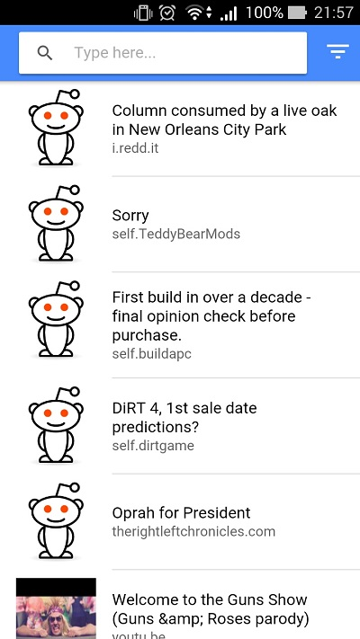

# App My Reader :panda_face:
Este repositório contém um app em Ionic 2 baseado no tutorial [Tableless](https://tableless.com.br/criando-uma-aplicacao-movel-com-ionic-2-e-angular-2-em-dez-passos/)



# Requisitos
* [Node.js](https://nodejs.org/en/)
* [Ionic](https://ionicframework.com/docs/intro/installation/)

# Rodando App...
No navegador basta iniciar o servidorzinho do Ionic (na pasta do projeto):

```
> ionic serve

```
